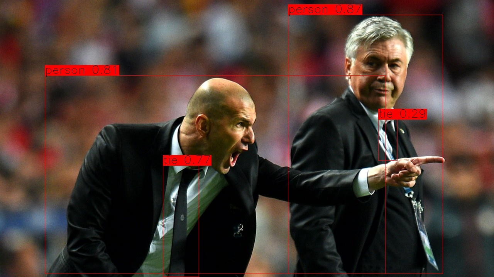
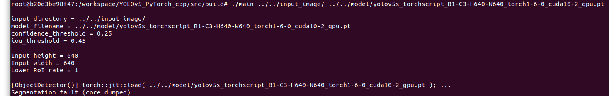

# YOLOv5 with PyTorch c++

A c++ implementation of [Ultralytics LLC's YOLOv5](https://github.com/ultralytics/yolov5) with [PyTorch c++ API](https://pytorch.org/cppdocs/) (LibTorch) inspired by [yasenh/libtorch-yolov5](https://github.com/yasenh/libtorch-yolov5).




# Pre-requirements

Docker 19.03 or later with NVIDIA Container Toolkit is recommended to run this code without having troubles related to dependencies' version.

* Docker 19.03+
* NVIDIA driver
* NVIDIA Container Toolkit


# How to build

In the host machine, pull a docker image from [my DockerHub repository](https://hub.docker.com/repository/docker/hotsuyuki/ubuntu18_04-cuda10_2-cudnn7_6_5-tensorrt7_0_0-opencv4_4_0) and launch a docker container.

```
$ git clone https://github.com/hotsuyuki/YOLOv5_PyTorch_cpp.git
$ cd YOLOv5_PyTorch_cpp/
$ docker container run --gpus all --rm -it -v $PWD:/workspace/YOLOv5_PyTorch_cpp hotsuyuki/ubuntu18_04-cuda10_2-cudnn7_6_5-tensorrt7_0_0-opencv4_4_0
```

Then in the docker container, download LibTorch v1.6.0 and unzip it by running `before_build.sh`.

```
# cd /workspace/YOLOv5_PyTorch_cpp/
# sh ./before_build.sh
```

Finally, build the source code.

```
# cd /workspace/YOLOv5_PyTorch_cpp/src/
# mkdir build
# cd build/
# cmake ..
# cmake --build .
```

This command would produce an executable file `main` in the `build` directory. 


# How to run

The executable file `main` requires at least two arguments:

* `input-dir` (directory path to the input images)
* `model-file` (file path to the model weights)

## (a) Inference on CPU:

```
# ./main --input-dir ../../input_image/ --model-file ../../model/yolov5s_torchscript_B1-C3-H640-W640_torch1-6-0_cuda10-2_cpu.pt
```
or
```
# ./main ../../input_image/ ../../model/yolov5s_torchscript_B1-C3-H640-W640_torch1-6-0_cuda10-2_cpu.pt
```

## (b) Inference on GPU:

```
# ./main --input-dir ../../input_image/ --model-file ../../model/yolov5s_torchscript_B1-C3-H640-W640_torch1-6-0_cuda10-2_gpu.pt
```
or
```
# ./main ../../input_image/ ../../model/yolov5s_torchscript_B1-C3-H640-W640_torch1-6-0_cuda10-2_gpu.pt
```

*NOTE: The model file name ends with "_cpu.pt" when using CPU, whereas it ends with "_gpu.pt" when using GPU.*

This repository provides two TorchScript model files:

* yolov5s_torchscript_B1-C3-H640-W640_torch1-6-0_cuda10-2_cpu.pt 
* yolov5s_torchscript_B1-C3-H640-W640_torch1-6-0_cuda10-2_gpu.pt 

(Both are exported from [ultralytics/yolov5/models/export.py](https://github.com/ultralytics/yolov5/blob/master/models/export.py))

The full arguments and options are shown below:

```
usage:
  main [OPTION...] input-dir model-file

positional arguments:
  input-dir   String: Path to input images directory
  model-file  String: Path to TorchScript model file

options:
      --conf-thres arg  Float: Object confidence threshold (default: 0.25)
      --iou-thres arg   Float: IoU threshold for NMS (default: 0.45)
  -h, --help            Print usage
```


# Trouble shooting

### Problem:

Sometimes, the YOLOv5 program becames no responce (or stops with segmentation fault) while loding a TorchScript model using `torch::jit::load()`.



### Solution:

Usually, the TorchScript model can be loaded within a few seconds.
If the program keeps loading the model more than a minute, it is recommended to stop the program by `Ctrl + c`, and rerun it. 
(This problem does not happen in other TorchScript file, so the root cause might be in the exported TorchScript file.)


# References

* [ultralytics/yolov5](https://github.com/ultralytics/yolov5)
* [yasenh/libtorch-yolov5](https://github.com/yasenh/libtorch-yolov5)
* [TadaoYamaoka/cxxopts/include/cxxopts.hpp](https://github.com/TadaoYamaoka/cxxopts/blob/master/include/cxxopts.hpp)